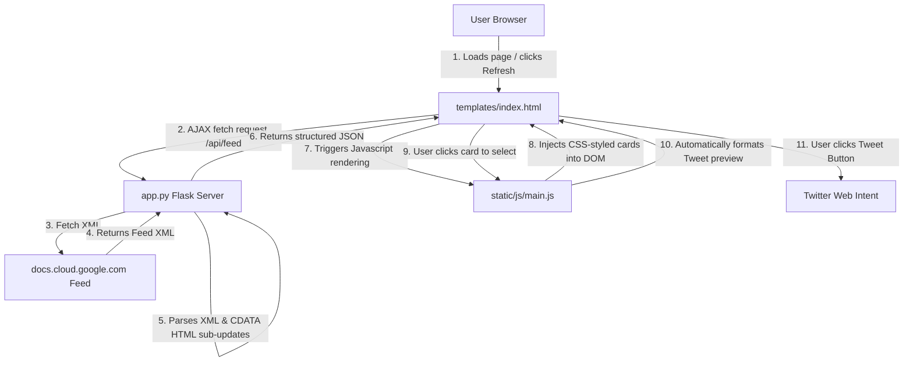

# BigQuery Release Notes Hub & Twitter Composer

A web application built using Python Flask, vanilla HTML5, JavaScript (ES6+), and CSS3 to fetch, parse, search, filter, and share Google Cloud BigQuery Release Notes via Twitter.

## Project Structure

```
bq-releases-notes/
│
├── .venv/                  # Python virtual environment (ignored)
├── static/
│   ├── css/
│   │   └── style.css       # Premium glassmorphic interface stylesheet
│   └── js/
│       └── main.js         # Frontend interactive logic (search, filter, composer)
│
├── templates/
│   └── index.html          # Main HTML structure
│
├── app.py                  # Python Flask server (fetches XML feed, parses HTML nodes)
├── test_app.py             # Python Unit tests (tests endpoints & parsing mock XML)
├── .gitignore              # Files to ignore in version control
└── README.md               # Documentation
```

## How the Files Interact

The application follows a client-server architecture. Here is the flow of interactions:



### Flow Breakdown:
1. **Server Boot (`app.py`)**: Bootstraps the Flask application. Serves the index page and sets up the `/api/feed` endpoint.
2. **API Endpoint (`app.py` -> `fetch_and_parse_feed`)**:
   - Downloads the live XML feed from Google Cloud.
   - Extracts release `<entry>` containers.
   - Breaks down each entry's HTML content by `<h3>` tags to separate granular items like **Features**, **Announcements**, **Breaking**, **Changes**, and **Issues**.
   - Converts the items into standard JSON blocks and sends them to the client.
3. **Frontend Rendering (`main.js` & `style.css`)**:
   - Requests the feed, filters the list dynamically by search text or category tags.
   - Renders a clean release timeline. Each update item gets a styled card.
4. **Composer Logic (`main.js` -> `handleCardSelection` -> `regenerateTweetDraft`)**:
   - Selecting a card copies its details (date, category, content, link) into the Tweet Composer.
   - Fits the description to the Twitter 280-character limit with smart ellipsis truncation.
   - Dynamically adds/removes selected hashtags and provides a live circular SVG character progress ring.
   - Clicking **Post Draft** launches a Twitter web intent to allow secure publishing.

---

## Getting Started

### 1. Prerequisites
- Python 3.9+ installed
- Git installed (optional, for code tracking)

### 2. Installation & Setup
Clone or navigate to the project directory:

1. **Create Virtual Environment**:
   ```bash
   python -m venv .venv
   ```

2. **Activate Virtual Environment**:
   - **Windows PowerShell**:
     ```powershell
     .venv\Scripts\Activate.ps1
     ```
   - **Windows Command Prompt (CMD)**:
     ```cmd
     .venv\Scripts\activate.bat
     ```
   - **macOS/Linux**:
     ```bash
     source .venv/bin/activate
     ```

3. **Install Dependencies**:
   ```bash
   pip install flask requests beautifulsoup4
   ```

### 3. Running the Server
Launch the Flask development server:
```bash
python app.py
```
Open your web browser and go to: **`http://127.0.0.1:5000`**

---

## Testing the Project

A comprehensive unit test suite is provided in `test_app.py`. It uses mock data to test parsing offline, avoiding rate limits or network issues during test runs.

### How to Run Tests
With your virtual environment activated, run:

```bash
python -m unittest test_app.py
```

### Test Case Overview:
1. **`test_index_route`**: Validates that the homepage responds with status code `200 OK` and contains the correct main header markup.
2. **`test_feed_parsing`**: Feeds a mock Atom XML string into the parser and checks that:
   - Elements are extracted correctly.
   - Multiple `<h3>` updates in a single day are successfully separated into individual records.
   - Text formats, categories, and links are parsed correctly.
3. **`test_api_endpoint`**: Mocks a successful external feed response and tests the `/api/feed` routing structure and HTTP status code.
